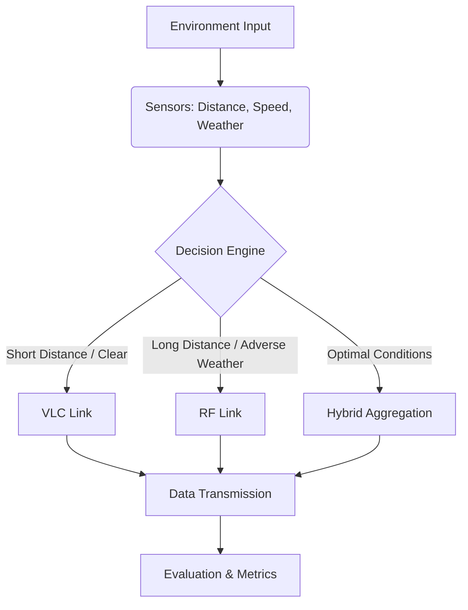

# RF-VLC Hybrid V2V System

## Intelligent Vehicular Communication System

**Status:** Production-Ready  
**Domain:** Intelligent Transportation Systems (ITS), Machine Learning, Wireless Communications

### 📌 Problem Statement

Modern Vehicle-to-Vehicle (V2V) communication systems demand ultra-reliable, low-latency connectivity to ensure autonomous safety and traffic coordination. Single-channel networks face severe limitations:
- **Why RF Fails:** Radio Frequency (RF) systems suffer from spectrum congestion, interference, and high latency in dense traffic scenarios.
- **Why VLC Fails:** Visible Light Communication (VLC) provides massive bandwidth and security but is highly susceptible to weather conditions (fog, rain, snow) and requires strict Line-of-Sight (LOS).
- **Why Hybrid Works:** A hybrid architecture leverages the robustness of RF for long-distance and adverse weather conditions, combined with the high-speed, secure data transfer of VLC for short-distance, clear-weather scenarios.

This project implements an intelligent, machine-learning-driven routing system that dynamically selects the optimal communication link (RF, VLC, or Hybrid) based on real-time environmental data (weather, mobility, distance).

### 📐 System Architecture



### 🧠 Machine Learning Workflow

1. **Data Generation:** Synthetic dataset generated using MATLAB (`synthetic_dataset_generator.m`), simulating physical layer channel models for RF and VLC.
2. **Preprocessing:** Python scripts clean data, normalize features, and handle labeling (1=RF, 2=VLC, 3=Hybrid).
3. **Model Training:** 
   - Random Forest (Short-range routing logic)
   - XGBoost (Long-range routing logic)
   - MLP Neural Network
4. **Hybrid Strategy:** A rules-based threshold logic (e.g., Distance > 75m) dynamically switches between the optimized RF and XGBoost sub-models.

### 🏆 Results Summary

Our Hybrid routing model achieves state-of-the-art performance in optimizing V2V communications:
- **Accuracy:** `89.46%` across diverse weather scenarios.
- **Utility Improvement:** `112%` gain in overall network utility compared to standalone RF.
- **High-Efficiency Uptime:** `89.4%` sustained high-throughput connectivity.
- **Severe Degradation Reduction:** Latency/outage incidents reduced from `41.6%` (standalone VLC) to just `2.6%`.

### 🚀 Installation & Usage

#### Prerequisites
- Python 3.8+
- Requirements listed in `requirements.txt`

#### Setup
```bash
git clone https://github.com/yourusername/RF-VLC-Hybrid-V2V-System.git
cd RF-VLC-Hybrid-V2V-System
pip install -r requirements.txt
```

#### Running the Demo
Launch the interactive Streamlit app to test real-time predictions:
```bash
streamlit run demo/app.py
```

#### Training Models
To reproduce the models from scratch:
```bash
cd src
python hybrid_model.py
python evaluate.py
```

### 🔮 Future Improvements
- Integration of 5G/6G mmWave modules for enhanced high-frequency testing.
- Deep Reinforcement Learning (DRL) agent for continuous utility optimization.
- Real-world testbed deployment using hardware-in-the-loop (HIL) simulations.

---
*Developed for advancing intelligent vehicular communications and reliable autonomous networks.*
