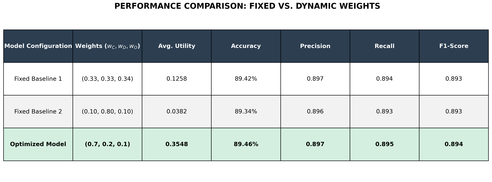

# Smart V2V Link Selection  
### Intelligent RF-VLC Hybrid Communication Framework for Autonomous Vehicles using Machine Learning & Utility Optimization


📄 **Full Research Paper Available in [/research](research/RF_VLC_HYBRID_LINK_SELECTION.pdf)**

---

## Project Overview

Modern autonomous vehicles require **ultra-reliable low-latency communication** for:

- Collision avoidance  
- Cooperative driving  
- Smart traffic systems  
- Autonomous navigation  

Traditional communication systems struggle under real-world conditions:

### RF Problems
- Spectrum congestion  
- Co-channel interference  
- Limited bandwidth  
- Performance degradation in dense traffic  

### VLC Problems
- Fog attenuation  
- Rain attenuation  
- LOS blockage  
- Distance degradation  

To solve this problem, this project introduces an **intelligent hybrid communication framework** that dynamically selects between:

- RF Communication  
- VLC Communication  
- Hybrid Link Aggregation  

using:

- Physics-based channel modeling  
- Utility optimization  
- Machine learning prediction  

---

# System Architecture


---

# Workflow

```text
Vehicle Parameters
    ↓
Synthetic Dataset Generation
    ↓
RF Channel Modeling
    ↓
VLC Channel Modeling
    ↓
Hybrid Link Aggregation
    ↓
Utility Optimization
    ↓
ML Model Training
    ↓
Real-Time Link Prediction
```

---

# Problem Statement

Standalone RF and VLC systems fail under dynamic vehicular conditions.

| Problem | RF | VLC |
|----------|----|------|
| Fog | Low impact | Severe impact |
| Rain | Moderate impact | High impact |
| Long Distance | Moderate | Severe |
| LOS Blockage | No | Yes |
| Interference | High | Low |

The objective is to dynamically choose the best communication link under varying environmental conditions.

---

# Dataset Generation

A synthetic dataset of **60,000 samples** was created using MATLAB.

### Features

- Inter-vehicle distance  
- Vehicle speed  
- Relative speed  
- Vehicle density  
- Rain rate  
- Fog attenuation coefficient  
- Weather class  
- LOS probability  

---

# RF Channel Modeling

### Path Loss
```math
PL = PL_0 + 10n\log_{10}(d) + shadow
```

### Rain Attenuation
```math
SNR_{RF}=SNR_{RF}e^{-0.06r}
```

### Gaseous Absorption
```math
SNR_{RF}=SNR_{RF}e^{-0.02d}
```

### Doppler Fading
```math
SNR_{RF}=SNR_{RF}e^{-v/100}
```

---

# VLC Channel Modeling

### Optical Channel Gain
```math
H=\frac{(m+1)A}{2\pi d^2}
```

### Fog Attenuation
```math
H=He^{-18\beta(d/1000)}
```

### LOS Blockage
```math
P_{LOS}=e^{-kdensity*d/1000}
```

### Mobility Misalignment
```math
SNR_{VLC}=SNR_{VLC}e^{-v/80}
```

---

# Hybrid Link Aggregation

The hybrid model combines both RF and VLC dynamically.

### Hybrid Capacity
```math
C_{HYB}=0.6(C_{RF}+C_{VLC})
```

### Hybrid Outage
```math
P_{out(HYB)}=P_{out(RF)}P_{out(VLC)}
```

---

# Utility Optimization

The system maximizes:

```math
U = w_CC - w_DD - w_OP
```

Where:

- C = Capacity  
- D = Delay  
- P = Outage Probability  

---

## Fixed Baselines

### Baseline 1
```math
(0.33,0.33,0.34)
```

### Baseline 2
```math
(0.10,0.80,0.10)
```

---

## Optimized Weights
```math
(0.7,0.2,0.1)
```

---

# Machine Learning Models Used

- Random Forest  
- Decision Tree  
- XGBoost  
- Hybrid RF + XGBoost model  

---

# Project Results

---

## Performance Comparison

| Model | Avg Utility | Accuracy |
|---------|-------------|------------|
| Fixed Baseline 1 | 0.1258 | 89.42% |
| Fixed Baseline 2 | 0.0382 | 89.34% |
| Optimized Model | **0.3548** | **89.46%** |

---

## Final Metrics

| Metric | Value |
|---------|---------|
| Accuracy | 89.46% |
| Precision | 0.897 |
| Recall | 0.895 |
| F1 Score | 0.894 |
| Utility Improvement | 112.1% |
| High Efficiency Uptime | 89.4% |
| Severe Degradation Events | 2.6% |

---

# Result Visualizations

## Utility vs Distance


---

## Utility vs Fog Density (20m)


---

## Utility vs Fog Density (60m)


---

## Delay vs Distance


---

## Utility Under Weather Conditions


---

## Fixed vs Dynamic Optimization


---

# Streamlit Demo

Run interactive demo:

```bash
streamlit run demo/app.py
```

Users can input:

- Distance  
- Speed  
- Fog density  
- Rain rate  
- Vehicle density  

Output:

- RF  
- VLC  
- Hybrid  

---

# Installation

```bash
git clone https://github.com/TejasTechluxverse7/smart-v2v-link-selection.git
cd smart-v2v-link-selection
pip install -r requirements.txt
```

---

# How to Run

### Train Random Forest
```bash
python src/train_random_forest.py
```

---

### Train XGBoost
```bash
python src/train_xgboost.py
```

---

### Evaluate Models
```bash
python src/evaluate.py
```

---

### Run Demo
```bash
streamlit run demo/app.py
```

---

# Repository Structure

```bash
smart-v2v-link-selection/
│
├── data/
├── dataset_generation/
├── notebooks/
├── src/
├── docs/
├── results/
├── demo/
├── examples/
├── research/
│   ├── RF_VLC_HYBRID_LINK_SELECTION.pdf
│   ├── ieee_paper.tex
│   ├── references.md
│   └── formulas.md
└── README.md
```

---

# Why This Project Stands Out

This project combines:

- Wireless Communication Engineering  
- Machine Learning  
- Optimization Algorithms  
- Real-world Environmental Modeling  
- Deployment using Streamlit  

Unlike traditional ML projects, this project solves a real communication systems problem with both engineering depth and practical deployment.

---

# Applications

- Autonomous Vehicles  
- V2V Communication  
- Smart Cities  
- Intelligent Transportation Systems  
- 6G Vehicular Networks  

---

# Future Work

- Reinforcement Learning  
- Real-world vehicular datasets  
- Edge deployment  
- 6G integration  
- IoT integration  

---

# Research Paper

This repository includes a complete IEEE-style research paper covering the theoretical and experimental foundations of this project:

- **System Architecture:** Detailed breakdown of the hybrid V2V communication stack.
- **Mathematical Modeling:** Physics-based derivation of RF and VLC channel models.
- **Utility Optimization:** Multi-objective function design for link selection.
- **Machine Learning Pipeline:** Comparative analysis of ensemble methods.
- **Experimental Analysis:** Performance evaluation across diverse environmental scenarios.

[View Full Research Paper (PDF)](research/RF_VLC_HYBRID_LINK_SELECTION.pdf)

---

# Author

**Group Members:**
- **Tejas Kondhalkar**  
Electronics and Communication Engineering  
Faculty of Technology, University of Delhi  

[LinkedIn](https://www.linkedin.com/in/tejas-vilas-kondhalkar-98a9b41b1) | [Email](mailto:tejasvilas04@gmail.com)

---

# License
MIT License
