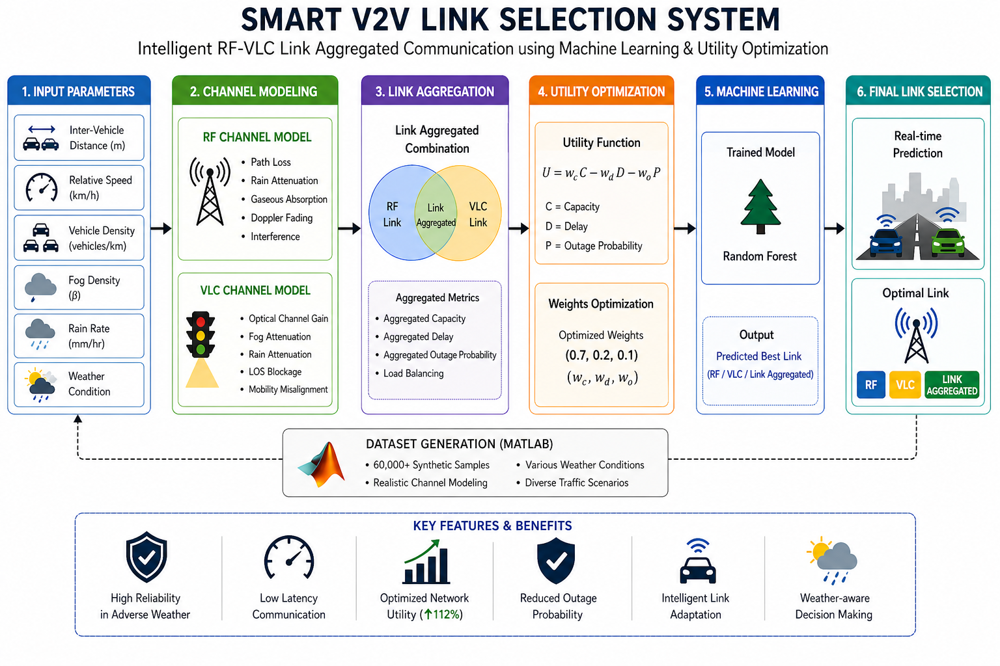

# Smart V2V Link Selection  
### Intelligent RF-VLC Hybrid Communication Framework for Autonomous Vehicles using Machine Learning & Utility Optimization


📄 **Full Research Paper Available in [/research](research/RF_VLC_HYBRID_LINK_SELECTION.pdf)**

---

## Project Overview

Modern autonomous vehicles require **ultra-reliable low-latency communication** for safety-critical applications. This project introduces an **intelligent hybrid communication framework** that dynamically selects between **RF**, **VLC**, and **Hybrid** link aggregation using:

- **Physics-based channel modeling** (Weather-aware attenuation)
- **Multi-objective utility optimization**
- **Machine Learning Ensemble** (Random Forest + XGBoost)

---

# System Architecture & Workflow



```text
Vehicle Parameters → Synthetic Dataset (MATLAB) → Channel Modeling → Utility Optimization → ML Training → Real-Time Link Prediction
```

---

# Mathematical Core

To ensure high-fidelity performance, the system models physical channel degradation and link utility. 

> [!NOTE]
> Detailed mathematical derivations for RF/VLC path loss, rain/fog attenuation, and outage probability are available in [research/formulas.md](research/formulas.md).

### 1. Hybrid Link Aggregation
The hybrid model aggregates bandwidth from both RF and VLC channels when environmental conditions permit:

```math
C_{HYB} = 0.6(C_{RF} + C_{VLC})
```

```math
P_{out(HYB)} = P_{out(RF)}P_{out(VLC)}
```

### 2. Utility Optimization
The system maximizes a custom utility function **U** to select the optimal link:

```math
U = w_CC - w_DD - w_OP
```

Where:
- **C** = Capacity
- **D** = Delay
- **P** = Outage Probability

---

# Machine Learning Performance

The framework achieves state-of-the-art results by leveraging a distance-based ensemble strategy.

| Model | Avg Utility | Accuracy |
|---------|-------------|------------|
| Fixed Baseline 1 | 0.1258 | 89.42% |
| Optimized Model | **0.3548** | **89.46%** |

### Key Metrics
- **Utility Improvement:** 112.1%
- **Accuracy:** 89.46%
- **Severe Degradation Reduction:** Outages reduced to 2.6%

---

# Quick Start

### 1. Installation
```bash
git clone https://github.com/TejasTechluxverse7/smart-v2v-link-selection.git
cd smart-v2v-link-selection
pip install -r requirements.txt
```

### 2. Run Interactive Demo
Launch the Streamlit app to test real-time link predictions under varying weather and mobility constraints:
```bash
streamlit run demo/app.py
```

### 3. Training & Evaluation
```bash
python src/train_random_forest.py
python src/train_xgboost.py
python src/evaluate.py
```

---

# Research & Documentation

This repository serves as a complete research artifact, including the full IEEE-style paper and detailed methodology.

- **[Full Research Paper (PDF)](research/RF_VLC_HYBRID_LINK_SELECTION.pdf)**
- **[Detailed Mathematical Formulas](research/formulas.md)**
- **[System Architecture Documentation](docs/architecture.md)**
- **[Methodology Breakdown](docs/methodology.md)**

---

# Author

**Group Members:**
- **Tejas Kondhalkar**  
Electronics and Communication Engineering  
Faculty of Technology, University of Delhi  

[LinkedIn](https://www.linkedin.com/in/tejas-vilas-kondhalkar-98a9b41b1) | [Email](mailto:tejasvilas04@gmail.com)

---

# License
MIT License
